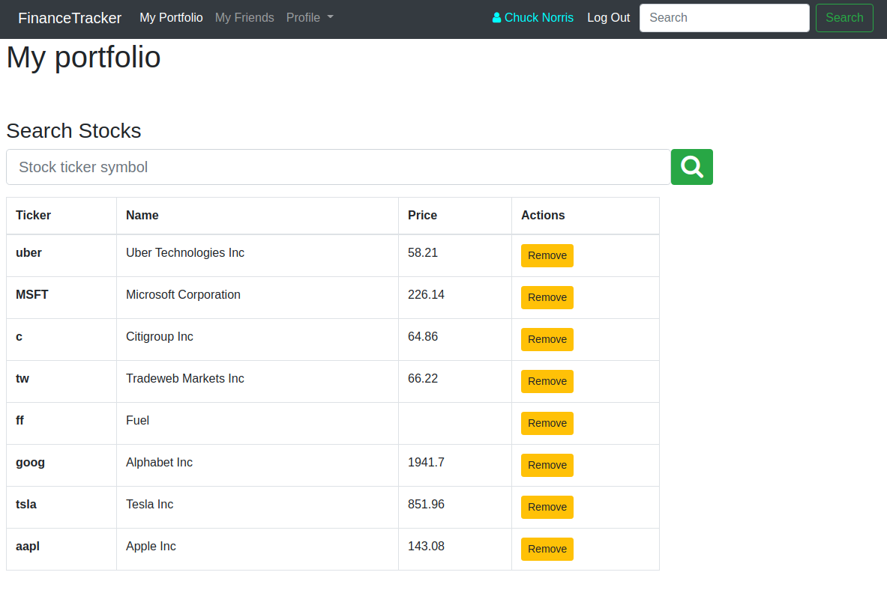

# Finance tracker

## Summary

### Project created for learning purposes, covering the basics of Ruby on Rails including, but not limited to

- Models, Views, and Controllers (MVC)
- Data Structures & Relationships
- Routing
- Migrations
- Views with forms, partials, and helpers
- RESTful design
- Adding gems for extra features
- Authentication
- Multiple level data models associations and relationships
- AJAX requests handling
- Consuming external source API

## Getting Started

- This app is functional financial stock tracker. Every logged in user can search for stock records live from IEX Cloud service API, track stock records and see what stock is tracked by friends.

  [Live Demo Link]()

## On your Computer

To get a local copy up and running follow these simple example steps.

## Prerequisites

- Any PC or device with an internet connection and ability to use the command
  line terminal

## Setup

- Open the command line terminal

## Install

- Go to your preferred directory
- Run `git clone` command
- Install Rails with all dependencies in order to run local server and app in
  it:
- `install Rails`
- `bundle install`
- `rails db:migrate`
- `rails db:seed` for sample populating the database

## Test

- Run `rails test:all` in your terminal to see if all tests are passing
- Run `bundle exec rspec spec` to see if Rspec test unit passing

## Usage

- Go to respective directory and run
- `rails server`
- Open LOCALHOST:3000 in your browser

## Built with

- Ruby 3.0.0
- Ruby on Rails 6.1.1
- Bootstrap
- Gems used listed in Gemfile

## Author

👤 **Igors Oleinikovs**

- GitHub: [Igors78](https://github.com/Igors78)
- Twitter: [@oleinikovs](https://twitter.com/oleinikovs)
- LinkedIn:
  [Oleinikovs Igors](https://www.linkedin.com/in/igors-oleinikovs-17a10958/)

## 🤝 Contributing

Contributions, issues, and feature requests are welcome!

## Show your support

Give a ⭐️ if you like this project!

## Acknowledgments

- Ruby documentation
- [Michael Hartl](https://www.michaelhartl.com/)

## 📝 License

This project is [UNLicense](./LICENSE) licensed.
